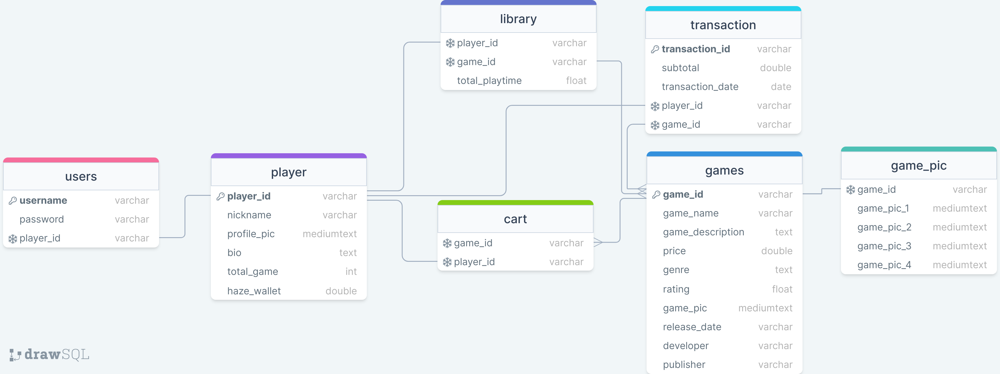

  <h2 align="center">
    Website Video Games Digital Distribution Service 
  </h2>

<!-- Daftar Isi -->

  
<h2 style="display: inline-block">Daftar Isi</h2>

  <ol>
    <li><a href="#anggota-tim">Anggota Kelompok</a></li>
    <li><a href="#fungsi">Fungsi</a></li>
    <li><a href="#tujuan">Tujuan</a></li>
    <li><a href="#target-pengguna">Target Pengguna</a></li>
    <li><a href="#mockup-kasar-sederhana">Mockup Kasar Sederhana</a></li>
    <li><a href="#skema-database">Skema Database</a></li>
  </ol>

<!-- Anggota Kelompok -->
## Anggota Kelompok
| NPM           | Name             |
| ------------- |------------------|
| 140810220020  | Nurkahfi A R     |
| 140810220026  | M Rumi Rifai     |
| 140810220078  | Anel Fuad Abiyyu |

<!-- Fungsi -->
## Fungsi

Website layanan distribusi game digital ini berperan sebagai platform yang memudahkan para pengguna untuk menjalankan transaksi pembelian game digital dengan cepat, aman, dan efisien. Pengguna dapat menjelajahi berbagai pilihan game digital dari berbagai genre dan platform, serta memiliki akses mudah untuk mengunduh atau membeli game yang mereka inginkan. Selain itu, website ini juga menyediakan informasi yang komprehensif tentang game yang ada sehingga pengguna dapat membuat keputusan yang lebih baik sebelum membeli dan membantu pengguna mendapatkan pengalaman membeli game yang lebih baik.

<!-- Tujuan -->
## Tujuan

Tujuan utama dari website ini adalah untuk menyediakan fasilitas yang memungkinkan pengguna untuk melakukan berbagai transaksi pembelian game digital dengan mudah dan efisien. Website ini bertujuan untuk:

* Menyediakan akses yang lebih mudah dan efisien.
* Memberikan informasi mengenai game yang ada.
* Menyediakan fasilitas pembayaran.
* Memastikan keamanan pengguna.

Dengan demikian, tujuan utama website ini adalah untuk menjadi tempat yang nyaman dan andal bagi pengguna yang ingin menjalankan transaksi pembelian game digital, menciptakan pengalaman yang positif dalam mendapatkan akses ke hiburan game online maupun offline.

<!-- Target pengguna -->
## Target pengguna

Website ini ditujukan untuk berbagai kalangan, khususnya para gamer dari beragam kelompok usia, mulai dari remaja hingga dewasa, serta tidak memandang jenis kelamin. Tujuannya adalah untuk menyediakan lingkungan yang inklusif dan ramah bagi semua pengguna. Dengan menyasar berbagai kelompok usia dan gender, website ini ingin memastikan bahwa setiap gamer, tanpa memandang latar belakangnya, dapat menemukan game digital yang sesuai dengan minat dan preferensi mereka.

<!-- Mockup Kasar Sederhana -->
## Mockup Kasar Sederhana

Berikut merupakan link untuk mockup kasar sederhana dari website layanan distribusi game digital:

https://www.figma.com/file/kipZEHYVdSpStsXO6MLDTZ/Untitled?type=design&node-id=0%3A1&mode=design&t=js9aK7ng6ol1WMrP-1

<!-- Skema Database -->
## Skema Database

Berikut merupakan rancangan skema database dari website layanan distribusi game digital.

proyek-web-kera created by GitHub Classroom